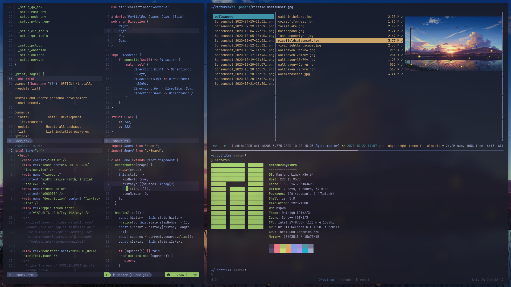

# dotfiles

## Screenshot



## Requirements

### zsh

Set `zsh` as your login shell:

```sh
chsh -s $(which zsh)
```

### vim

- Install VIM 8.

  ```sh
  sudo add-apt-repository ppa:jonathonf/vim

  # you may want to install vim-gtk3 for more features
  sudo apt install vim
  ```

- Check version of vim

  ```sh
  vim --version
  ```

### tmux

Steps to install Tmux from source

- Remove existing tmux install

  ```sh
  sudo apt remove -y --purge tmux
  ```

- Install build dependencies:

  ```sh
  sudo apt install -y automake build-essential cmake pkg-config
  sudo apt install -y exuberant-ctags libevent-dev libncurses5-dev
  ```

- Download from GitHub and cd to src dir

  ```sh
  git clone https://github.com/tmux/tmux.git
  cd tmux
  git checkout 2.6
  ```

- Configure, make, and make install

  ```sh
  sh autogen.sh
  ./configure && make -j"$(nproc)"
  sudo make install
  ```

- Check version of tmux

  ```sh
  tmux -V
  ```

## Install

```sh
git clone https://github.com/ndtho8205/dotfiles.git
cd dotfiles
git submodule update --init --recursive
./install.sh
```

## Notes

- I don't use any vim markdown preview plugin. Instead, I map <kbd>F5</kbd> to
  open Chrome on the editting buffer and use an extension
  [simov/markdown-viewer](https://github.com/simov/markdown-viewer) to render it
  (with `autoreload` enabled).

## TODO

- [ ] Refactor vim configs
  - [x] common
  - [x] plugins (auto-pairs, indentLine, lightline, papercolor)
  - [x] golang
  - [x] rust
  - [x] markdown
  - [ ] python: coc-python provides too much features that exceeds my needs
  - [ ] plugins (ale, coc.nvim, fzf.vim)
  - [ ] filetypes (shellscript, javascript, vue, kotlin)
- [ ] Refactor zsh configs
- [ ] Config tmux
